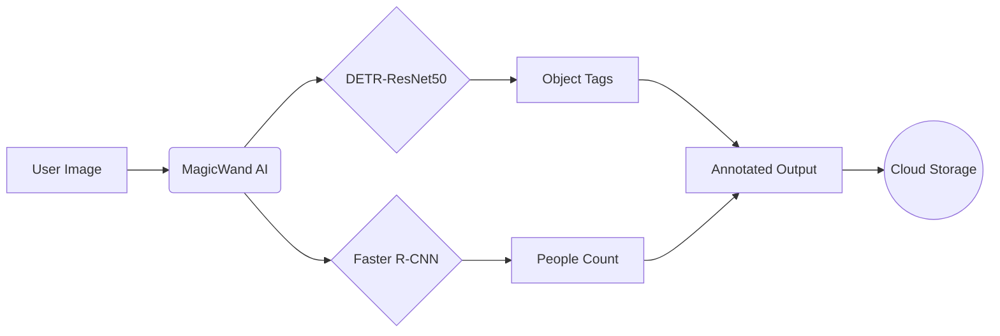

# BlockfyML CCMF - Restaurant Monitoring AI


<div align="center">
  
  
  
</div>

## 🚀 No-Code Drag & Drop AI Builder

BlockfyML allows you to create AI workflows with a conversational builder and a vast library of tools and pre-trained foundational deep learning models.

```diff
+ New in v2.1: Session persistence & multi-image batch processing
! Now supports real-time video streams via RTSP
```

